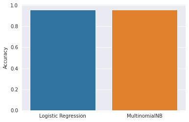
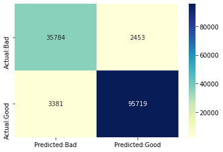
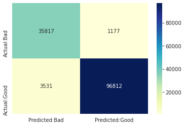
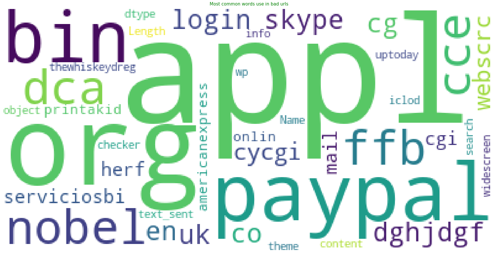

# URL Phishing Detection using NLP

A machine learning project that uses Natural Language Processing (NLP) techniques to detect phishing URLs by analyzing their textual patterns and features.

## 📋 Table of Contents
- [Overview](#overview)
- [Features](#features)
- [Dataset](#dataset)
- [Models](#models)
- [Results](#results)
- [Visualizations](#visualizations)
- [Installation](#installation)
- [Usage](#usage)
- [Project Structure](#project-structure)

## 🎯 Overview

This project implements a machine learning solution to classify URLs as either legitimate (good) or phishing (bad) by analyzing their textual characteristics using NLP techniques. The system tokenizes URLs, extracts features, and trains multiple classification models to achieve high accuracy in phishing detection.

## ✨ Features

- **Text Tokenization**: Uses RegexpTokenizer to extract meaningful tokens from URLs
- **Multiple ML Models**: Implements and compares different classification algorithms:
  - Logistic Regression
  - Multinomial Naive Bayes
  - Pipeline-based classifier
- **Word Cloud Analysis**: Visualizes common words in legitimate vs phishing URLs
- **Model Persistence**: Trained model saved as `phishing.pkl` for production use
- **Comprehensive Evaluation**: Includes confusion matrices, classification reports, and accuracy metrics

## 📊 Dataset

The project uses a labeled dataset of URLs containing:
- URL strings
- Binary labels (Good/Bad)
- Balanced/Imbalanced class distribution analysis

## 🤖 Models

### 1. Logistic Regression
- Classification algorithm for binary prediction
- Feature extraction using TF-IDF vectorization
- Confusion matrix visualization available

### 2. Multinomial Naive Bayes
- Probabilistic classifier based on Bayes' theorem
- Effective for text classification tasks
- Confusion matrix visualization available

### 3. Pipeline Model
- Integrated preprocessing and classification pipeline
- Streamlined prediction workflow
- Confusion matrix visualization available

## 📈 Results

### Model Accuracy Comparison



The bar chart shows comparative performance of all three models, enabling easy identification of the best-performing algorithm.

### Confusion Matrices

<table>
<tr>
<td></td>
<td></td>
<td></td>
</tr>
<tr>
<td align="center"><b>Logistic Regression</b></td>
<td align="center"><b>Multinomial Naive Bayes</b></td>
<td align="center"><b>Pipeline Model</b></td>
</tr>
</table>

These confusion matrices show the classification performance of each model, displaying true positives, true negatives, false positives, and false negatives.

## 🎨 Visualizations

### Word Cloud Analysis

Understanding the textual patterns in URLs is crucial for phishing detection. Below are word clouds showing the most common words found in legitimate and phishing URLs:

#### Common Words in Legitimate URLs


Legitimate URLs typically contain words related to established domains, common services, and standard web patterns.

#### Common Words in Phishing URLs


Phishing URLs often exhibit suspicious patterns, including misspellings, unusual character combinations, and attempts to mimic legitimate domains.

## 🚀 Installation

1. **Clone the repository**
```bash
git clone https://github.com/yourusername/url-nlp.git
cd url-nlp
```

2. **Install required packages**
```bash
pip install -r requierments.txt
```

Required libraries include:
- pandas
- numpy
- scikit-learn
- matplotlib
- seaborn
- nltk
- wordcloud
- plotly

## 💻 Usage

### Training the Model

Open and run the Jupyter notebook:
```bash
jupyter notebook notebooks/url-with-nlp.ipynb
```

Run all cells sequentially to:
1. Load and explore the dataset
2. Tokenize URLs and extract features
3. Train multiple classification models
4. Generate visualizations
5. Save the trained model

### Making Predictions

```python
import pickle

# Load the trained model
loaded_model = pickle.load(open('artifacts/phishing.pkl', 'rb'))

# Predict a URL
url = ["example-suspicious-url.com"]
result = loaded_model.predict(url)

print(f"Prediction: {'Phishing' if result[0] == 'bad' else 'Legitimate'}")
```

## 📁 Project Structure

```
url-nlp/
│
├── notebooks/
│   └── url-with-nlp.ipynb      # Main analysis notebook
│
├── plots/                       # Visualization outputs
│   ├── accuracies.png
│   ├── LogisticRegression_cm.png
│   ├── MultinomialNB_cm.png
│   ├── pipeline_cm.png
│   ├── Most_common_words_use_in_good_urls.png
│   └── Most_common_words_use_in_bad_urls.png
│
├── artifacts/
│   └── phishing.pkl            # Trained model
│
├── app/                        # (Future deployment code)
│
├── README.md
└── requierments.txt
```

## 🔍 Key Insights

1. **Text Patterns Matter**: The word cloud analysis reveals distinct patterns between legitimate and phishing URLs
2. **Model Comparison**: Multiple models were evaluated to ensure optimal performance
3. **Tokenization Impact**: Breaking URLs into tokens helps identify suspicious patterns
4. **High Accuracy**: The models achieve strong classification performance on test data

## 🛠️ Technologies Used

- **Python 3.x**: Primary programming language
- **Pandas & NumPy**: Data manipulation and numerical operations
- **Scikit-learn**: Machine learning algorithms and evaluation metrics
- **NLTK**: Natural language processing and tokenization
- **Matplotlib & Seaborn**: Data visualization
- **WordCloud**: Word frequency visualization
- **Plotly**: Interactive visualizations

## 📝 Future Improvements

- Implement deep learning models (LSTM, BERT)
- Add real-time URL checking API
- Expand feature engineering (URL length, special characters, etc.)
- Create web interface for easy URL testing
- Implement ensemble methods for improved accuracy
- Add more comprehensive datasets

---

**Note**: This is a graduation project demonstrating NLP-based phishing detection techniques.
